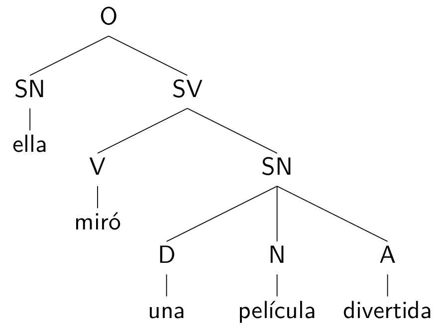
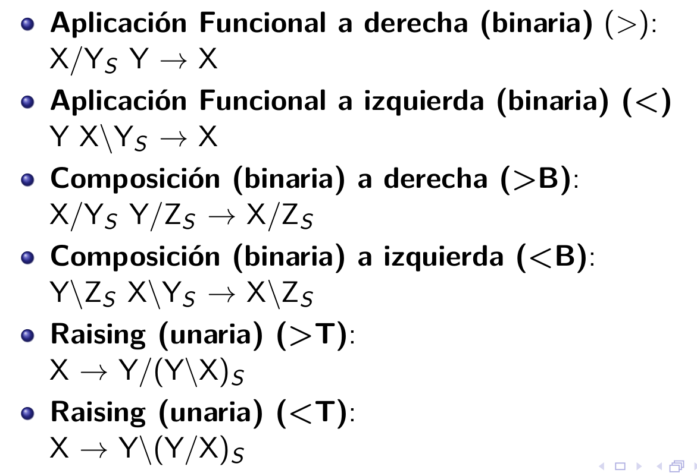

# Parsers

Antes de correr esta notebook hay que instalar Python 3, nltk para Python 3 y matplotlib para Python 3. cuidado al instalar, porque si tienen Python 2 en la computadora, instala todo por defecto para esa versión y entonces no funciona para la 3. Si se usa pip para instalar, usar el comando pip3. Pueden encontrar información sobre instalación en la página del Grupo de Lingüística Computacional Para que algunos comandos funcionen, además de hacer las instalaciones correspondientes, hay que descargar algunos archivos. En todos los casos, el código está armado para que esos archivos se descarguen en la misma carpeta en la que está la jupyter notebook. En caso de que se utilice otra ubicación, hay que editar el código.

# Gramáticas 

Las gramáticas se expresan usualmente en forma de reglas de reescritura de la forma X -> Z (X se reescribe como Z), aunque estas  reglas pueden concebirse también como árboles parcialmente construidos o como restricciones combinatorias. Las gramáticas típicamente permiten construir grafos dirigidos, coloquialmente denominados ''árboles''.
Existen tres grandes formas de construir las gramáticas según cómo se conciba la representación de la estructura jerárquica:
* Gramáticas basadas en constituyentes
* Gramáticas basadas en dependencias
* Gramáticas categoriales




# Gramáticas basadas en constituyentes

Poseen distinción entre nodos terminales y nodos no terminales, que especifican la categoría a la que pertenece una determinada subcadena.


```python
import nltk 
import re 
import os, sys
import matplotlib 
```

## Recursive descent Parser

- **Top-down**
- Parte del símbolo de inicio y aplica las reglas para obtener los constituyentes inmediatos y armar el árbol hasta llegar a los símbolos terminales. Chequea coincidencia con la secuencia del input. Si no hay coincidencia, tiene que retroceder y buscar diferentes alternativas de parseo. 


```python
# Recursive Descent Parser

def rd_parser(sentence, grammar):                   # define una función llamada rd_parser con dos argumentos
    print(grammar)                                  # imprime mi gramática
    sentence = sentence.lower()                     # convierte a minúscula la oración
    if sentence.endswith('.'):                      # si la oración termina con un punto
        sent = re.sub('\.',' ',sentence)            # se lo quita
    else:                                           # si no
        sent = sentence                             # la toma como está
    sent = sent.split()                             # divide la oración en palabras
    rd_parser = nltk.RecursiveDescentParser(grammar) # proceso esas palabras
    for tree in rd_parser.parse(sent):              # para cada árbol posible en mi gramática para esa oración
        print(tree)                                 # lo imprimo

```


```python
#Para correr el Recursive Descent Parser

print('Escribí una oración:')                          #Para que me pida que escriba una oración
oracion1 = input()                                     #Para que me abra un campo en el que escriba la oración
grammar = nltk.data.load('gramaticas/ContextFreeGrammar.cfg')     # establece cuál va a ser mi gramática
rd_parser(oracion1, grammar)                           #Para correr la función
```

**Demo del Right Descent Parser**


```python
nltk.app.rdparser()
```

    In /home/carranza/.local/lib/python3.6/site-packages/matplotlib/mpl-data/stylelib/_classic_test.mplstyle: 
    The text.latex.preview rcparam was deprecated in Matplotlib 3.3 and will be removed two minor releases later.
    In /home/carranza/.local/lib/python3.6/site-packages/matplotlib/mpl-data/stylelib/_classic_test.mplstyle: 
    The mathtext.fallback_to_cm rcparam was deprecated in Matplotlib 3.3 and will be removed two minor releases later.
    In /home/carranza/.local/lib/python3.6/site-packages/matplotlib/mpl-data/stylelib/_classic_test.mplstyle: Support for setting the 'mathtext.fallback_to_cm' rcParam is deprecated since 3.3 and will be removed two minor releases later; use 'mathtext.fallback : 'cm' instead.
    In /home/carranza/.local/lib/python3.6/site-packages/matplotlib/mpl-data/stylelib/_classic_test.mplstyle: 
    The validate_bool_maybe_none function was deprecated in Matplotlib 3.3 and will be removed two minor releases later.
    In /home/carranza/.local/lib/python3.6/site-packages/matplotlib/mpl-data/stylelib/_classic_test.mplstyle: 
    The savefig.jpeg_quality rcparam was deprecated in Matplotlib 3.3 and will be removed two minor releases later.
    In /home/carranza/.local/lib/python3.6/site-packages/matplotlib/mpl-data/stylelib/_classic_test.mplstyle: 
    The keymap.all_axes rcparam was deprecated in Matplotlib 3.3 and will be removed two minor releases later.
    In /home/carranza/.local/lib/python3.6/site-packages/matplotlib/mpl-data/stylelib/_classic_test.mplstyle: 
    The animation.avconv_path rcparam was deprecated in Matplotlib 3.3 and will be removed two minor releases later.
    In /home/carranza/.local/lib/python3.6/site-packages/matplotlib/mpl-data/stylelib/_classic_test.mplstyle: 
    The animation.avconv_args rcparam was deprecated in Matplotlib 3.3 and will be removed two minor releases later.


### Shift Reduce Parse


```python
#Shift Reduce Parser

def sr_parser(sentence, grammar):                      # define la función sr_parser con dos argumentos
    print(grammar)                                     # imprimte la gramática
    sentence = sentence.lower()                        # convierte a minúscula
    if sentence.endswith('.'):                         # si la oración termina con un punto
        sent = re.sub('\.',' ',sentence)               # se lo quita
    else:                                              # si no
        sent = sentence                                # la toma como está
    sent = sent.split()                                # divide la oración en palabras
    sr_parser = nltk.ShiftReduceParser(grammar)        # proceso esas palabras
    for tree in sr_parser.parse(sent):                 # para cada árbol posible en mi gramática para esa oración
        print(tree)                                    # lo imprimo

```


```python
print('Escribí una oración:')                           # imprime un mensaje pidiendo que escriba una oración
oracion2 = input()                                      # asigna a una variable mi oración como valor
grammar = nltk.data.load('gramaticas/ContextFreeGrammar.cfg')      # asigna a una variable mi gramática como valor
sr_parser(oracion2, grammar)   
```

**Desventajas:**

- La recursividad a la izquierda (NP -> NP PP) lo lleva al loop infinito

- Pierde mucho tiempo considerando las estructuras que no se corresponden con el input

- En el proceso de backtracking se descartan los parseos anteriores y tiene que volver a construirlos 


**Demo del Shift and Reduce parser**


```python
nltk.app.srparser()
```

    Warning: VP -> V NP PP will never be used


## Chart Parser (solo demo)


```python
#Demo para el Chart Parser
nltk.app.chartparser()
```

    grammar= (
    ('    ', 'S -> NP VP,')
    ('    ', 'VP -> VP PP,')
    ('    ', 'VP -> V NP,')
    ('    ', 'VP -> V,')
    ('    ', 'NP -> Det N,')
    ('    ', 'NP -> NP PP,')
    ('    ', 'PP -> P NP,')
    ('    ', "NP -> 'John',")
    ('    ', "NP -> 'I',")
    ('    ', "Det -> 'the',")
    ('    ', "Det -> 'my',")
    ('    ', "Det -> 'a',")
    ('    ', "N -> 'dog',")
    ('    ', "N -> 'cookie',")
    ('    ', "N -> 'table',")
    ('    ', "N -> 'cake',")
    ('    ', "N -> 'fork',")
    ('    ', "V -> 'ate',")
    ('    ', "V -> 'saw',")
    ('    ', "P -> 'on',")
    ('    ', "P -> 'under',")
    ('    ', "P -> 'with',")
    )
    tokens = ['John', 'ate', 'the', 'cake', 'on', 'the', 'table']
    Calling "ChartParserApp(grammar, tokens)"...
    [('under',)]
    [('with',)]
    [('on',)]
    [('under',), ('with',)]
    [('ate',)]
    [('saw',)]
    [('cake',)]
    [('fork',)]
    [('table',)]
    [('cake',), ('fork',)]
    [('cookie',)]
    [('table',), ('cake',), ('fork',)]
    [('dog',)]
    [('cookie',), ('table',), ('cake',), ('fork',)]
    [('my',)]
    [('a',)]
    [('the',)]
    [('my',), ('a',)]
    [('John',)]
    [('I',)]
    [(Det, N)]
    [(NP, PP)]
    [(V, NP)]
    [(V,)]
    [(VP, PP)]
    [(V, NP), (V,)]
    S [(NP, VP)]
    VP [(VP, PP), (V, NP), (V,)]
    NP [(Det, N), (NP, PP)]
    PP [(P, NP)]
    NP [('John',), ('I',)]
    Det [('the',), ('my',), ('a',)]
    N [('dog',), ('cookie',), ('table',), ('cake',), ('fork',)]
    V [('ate',), ('saw',)]
    P [('on',), ('under',), ('with',)]


## Bllip Parser

Antes hay que instalar el bllip parser. 

Para hacerlo, correr el siguiente comando en la terminal:

    pip3 install --user bllipparser

Brown Laboratory for Linguistic Information Processing

Introduce gramáticas a partir de un corpus


```python
from bllipparser import RerankingParser                             #Importa el parser
from bllipparser.ModelFetcher import download_and_install_model     # Descarga e instala el "modelo"

model_dir = download_and_install_model('WSJ', 'tmp/models')         #Crea una variable con el "modelo"
rrp = RerankingParser.from_unified_model_dir(model_dir)
```


```python
oracion2 = "john runs through the hill"
rrp.simple_parse(oracion2)
```


    '(S1 (S (NP (NNP john)) (VP (VBZ runs) (PP (IN through) (NP (DT the) (NN hill))))))'


```python
oracion3 = "No one saw him disembark in the unanimous night, no one saw the bamboo canoe sink into the sacred mud, but in a few days there was no one who did not know that the taciturn man came from the South"
rrp.simple_parse(oracion3)
```


    '(S1 (S (S (NP (DT No) (NN one)) (VP (VBD saw) (S (NP (PRP him)) (VP (VBP disembark) (PP (IN in) (NP (DT the) (JJ unanimous) (NN night))))))) (, ,) (S (NP (DT no) (NN one)) (VP (VBD saw) (S (NP (DT the) (NN bamboo) (NN canoe)) (VP (VB sink) (PP (IN into) (NP (DT the) (JJ sacred) (NN mud))))))) (, ,) (CC but) (S (PP (IN in) (NP (DT a) (JJ few) (NNS days))) (NP (EX there)) (VP (VBD was) (NP (NP (DT no) (NN one)) (SBAR (WHNP (WP who)) (S (VP (VBD did) (RB not) (VP (VB know) (SBAR (IN that) (S (NP (DT the) (JJ taciturn) (NN man)) (VP (VBD came) (PP (IN from) (NP (DT the) (NNP South)))))))))))))))'


```python
print('Escribí una oración en inglés')
oracion4 = input()
rrp.simple_parse(oracion4)
```

# Gramáticas basadas en dependencias

No poseen distinción entre símbolos no terminales y terminales. Las estructuras representan relaciones de dependencia entre terminales.
Ejemplos de parsers de dependencias:
* Maltparser (http://www.maltparser.org/)
* SyntaxNet (Estaba alojado en https://opensource.google.com/projects/syntaxnet, como parte de los recursos de la librería para Inteligencia Artificial TensorFlow de Google, pero en este momento no está disponible y se [rumorea](https://github.com/tensorflow/models/issues/8411) que se lo va a mover al github de [google-research](https://github.com/google-research/google-research))
* Dependency parser de Spacy (https://spacy.io/usage/linguistic-features#dependency-parse)

## Spacy - Dependency parser

### Nota para quien no tenga la MV: 

Antes de correr hay que instalar spacy. Con pip3, eso se puede hacer con el comando 

`pip3 install spacy`

Hay que instalar también es_core_news_sm, un modelo entrenado mediante un corpus del español, con el comando

`python3 -m spacy download es_core_news_sm`

Alternativamente puede probarse de instalar es_core_news_md.

`python3 -m spacy download es_core_news_md`

En ese caso, para correrlo hay que cambiar en el código de abajo `es_core_news_sm` por `es_core_news_md`


```python
import spacy
from nltk import Tree
from spacy import displacy 

def gramaticadependencias(sentence):       #Define la función
    nlp = spacy.load('es_core_news_sm')    #Carga el modelo entrenado
    doc = nlp(sentence)                    #define una variable doc con la oración procesada por el modelo
    #for token in doc:               
        #print(token.text, token.dep_, token.head.text, token.head.pos_,
        #    [child for child in token.children])
    displacy.render(doc, style='dep', jupyter=True)

```


```python
print('Escribí una oración')
oracion5 = input()
gramaticadependencias(oracion5)
```

    Escribí una oración
    Fernando nos aprueba a todos.


<svg xmlns="http://www.w3.org/2000/svg" xmlns:xlink="http://www.w3.org/1999/xlink" xml:lang="es" id="22808df49f274e349ff10735f4ae04a9-0" class="displacy" width="925" height="312.0" direction="ltr" style="max-width: none; height: 312.0px; color: #000000; background: #ffffff; font-family: Arial; direction: ltr">
<text class="displacy-token" fill="currentColor" text-anchor="middle" y="222.0">
    <tspan class="displacy-word" fill="currentColor" x="50">Fernando</tspan>
    <tspan class="displacy-tag" dy="2em" fill="currentColor" x="50">PROPN</tspan>
</text>

<text class="displacy-token" fill="currentColor" text-anchor="middle" y="222.0">
    <tspan class="displacy-word" fill="currentColor" x="225">nos</tspan>
    <tspan class="displacy-tag" dy="2em" fill="currentColor" x="225">PRON</tspan>
</text>

<text class="displacy-token" fill="currentColor" text-anchor="middle" y="222.0">
    <tspan class="displacy-word" fill="currentColor" x="400">aprueba</tspan>
    <tspan class="displacy-tag" dy="2em" fill="currentColor" x="400">VERB</tspan>
</text>

<text class="displacy-token" fill="currentColor" text-anchor="middle" y="222.0">
    <tspan class="displacy-word" fill="currentColor" x="575">a</tspan>
    <tspan class="displacy-tag" dy="2em" fill="currentColor" x="575">ADP</tspan>
</text>

<text class="displacy-token" fill="currentColor" text-anchor="middle" y="222.0">
    <tspan class="displacy-word" fill="currentColor" x="750">todos.</tspan>
    <tspan class="displacy-tag" dy="2em" fill="currentColor" x="750">PRON</tspan>
</text>

<g class="displacy-arrow">
    <path class="displacy-arc" id="arrow-22808df49f274e349ff10735f4ae04a9-0-0" stroke-width="2px" d="M70,177.0 C70,2.0 400.0,2.0 400.0,177.0" fill="none" stroke="currentColor"/>
    <text dy="1.25em" style="font-size: 0.8em; letter-spacing: 1px">
        <textPath xlink:href="#arrow-22808df49f274e349ff10735f4ae04a9-0-0" class="displacy-label" startOffset="50%" side="left" fill="currentColor" text-anchor="middle">nsubj</textPath>
    </text>
    <path class="displacy-arrowhead" d="M70,179.0 L62,167.0 78,167.0" fill="currentColor"/>
</g>

<g class="displacy-arrow">
    <path class="displacy-arc" id="arrow-22808df49f274e349ff10735f4ae04a9-0-1" stroke-width="2px" d="M245,177.0 C245,89.5 395.0,89.5 395.0,177.0" fill="none" stroke="currentColor"/>
    <text dy="1.25em" style="font-size: 0.8em; letter-spacing: 1px">
        <textPath xlink:href="#arrow-22808df49f274e349ff10735f4ae04a9-0-1" class="displacy-label" startOffset="50%" side="left" fill="currentColor" text-anchor="middle">obj</textPath>
    </text>
    <path class="displacy-arrowhead" d="M245,179.0 L237,167.0 253,167.0" fill="currentColor"/>
</g>

<g class="displacy-arrow">
    <path class="displacy-arc" id="arrow-22808df49f274e349ff10735f4ae04a9-0-2" stroke-width="2px" d="M595,177.0 C595,89.5 745.0,89.5 745.0,177.0" fill="none" stroke="currentColor"/>
    <text dy="1.25em" style="font-size: 0.8em; letter-spacing: 1px">
        <textPath xlink:href="#arrow-22808df49f274e349ff10735f4ae04a9-0-2" class="displacy-label" startOffset="50%" side="left" fill="currentColor" text-anchor="middle">case</textPath>
    </text>
    <path class="displacy-arrowhead" d="M595,179.0 L587,167.0 603,167.0" fill="currentColor"/>
</g>

<g class="displacy-arrow">
    <path class="displacy-arc" id="arrow-22808df49f274e349ff10735f4ae04a9-0-3" stroke-width="2px" d="M420,177.0 C420,2.0 750.0,2.0 750.0,177.0" fill="none" stroke="currentColor"/>
    <text dy="1.25em" style="font-size: 0.8em; letter-spacing: 1px">
        <textPath xlink:href="#arrow-22808df49f274e349ff10735f4ae04a9-0-3" class="displacy-label" startOffset="50%" side="left" fill="currentColor" text-anchor="middle">obj</textPath>
    </text>
    <path class="displacy-arrowhead" d="M750.0,179.0 L758.0,167.0 742.0,167.0" fill="currentColor"/>
</g>
</svg>


# Gramáticas Categoriales

Las gramáticas categoriales están conformadas principalmente por un conjunto reducido de reglas y un léxico sumamente rico.
Las reglas que utiliza OpenCCG, que es el parser categorial que vamos a ver son las siguientes:



Construir una gramática categorial consiste principalmente en elaborar un léxico lo suficientemente rico, ya que las gramáticas categoriales son fuertemente lexicalistas. En ellas, la categoría a la que pertenece cada entrada léxica codifica sus posibilidades combinatorias.

## Combinatory Categorial Grammar


```python
#Combinatory Categorial Grammar

from nltk.ccg import chart, lexicon

def combinatory_parser(sentence):   
    sentence = sentence.lower()                                     # convierte a minúscula
    if sentence.endswith('.'):                                      # si la oración termina con un punto
        sent = re.sub('\.',' ',sentence)                            # se lo quita
    else:                                                           # si no
        sent = sentence                                             # la toma como está
    sent = sent.split()                                             # divide la oración en palabras
    archivo = open('gramaticas/CategorialGrammar2.txt', 'r')
    codigogram = archivo.read()
    lex = lexicon.fromstring(codigogram)
    print(lex)
    parser = chart.CCGChartParser(lex, chart.DefaultRuleSet)
    archivo.close()
    for parse in parser.parse(sent):  # doctest: +SKIP
         chart.printCCGDerivation(parse)
         #break       

```


```python
print('Escribí una oración')
oracion5 = input()
combinatory_parser(oracion5)
```

# Gramáticas basadas en rasgos

Las gramáticas se pueden enriquecer con el uso de rasgos. Los rasgos son pares de atributo valor. En una gramática con rasgos, los rasgos se heredan de las entradas léxicas a los nodos superiores. Las reglas especifican los rasgos que sus nodos hijos deben compartir.


```python
nltk.data.show_cfg('gramaticas/GramaticaDeRasgos.fcfg')
```

    % start S
    #Adaptado al español de la gramática elaborada por Klein para el libro de NLTK
    #
    # ###################
    # Reglas de la Gramática
    # ###################
    # Reescritura de la Raíz
    S -> NP[NUM=?n] VP[NUM=?n]
    # Reescritura de NP
    NP[NUM=?n] -> PropN[NUM=?n] 
    NP[NUM=?n,GEN=?g] -> Det[NUM=?n,GEN=?g] N[NUM=?n,GEN=?g]
    # Reescritura de VP
    VP[TENSE=?t, NUM=?n] -> V[TENSE=?t, NUM=?n]
    # ###################
    # Lexical Productions
    # ###################
    Det[NUM=sg,GEN=masc] -> 'este' | 'el'
    Det[NUM=pl,GEN=masc] -> 'estos' | 'los'
    Det[NUM=sg,GEN=fem] -> 'esta' | 'la'
    Det[NUM=pl,GEN=fem] -> 'estas' | 'las'
    PropN[NUM=sg]-> 'Cata' | 'Julia' | 'Fede' | 'Fer' | 'Martín' | 'Maca' | 'Vicky' | 'Pablo'
    N[NUM=sg,GEN=fem] -> 'chica' | 'mujer' | 'persona' | 'criatura'
    N[NUM=sg,GEN=masc] -> 'chico' | 'hombre' | 'sujeto' 
    N[NUM=pl,GEN=fem] -> 'chicas' | 'mujeres' | 'personas' | 'criaturas'
    N[NUM=pl,GEN=masc] -> 'chicos' | 'hombres' | 'sujetos' 
    V[TENSE=pres,NUM=sg] -> 'desaparece' | 'camina' | 'muerde' | 'llora' | 'aparece' | 'viene' | 'estornudan'
    V[TENSE=pres,NUM=pl] -> 'desaparecen' | 'caminan' | 'lloran' | 'muerden' | 'aparecen' | 'vienen' | 'estornudan'
    V[TENSE=pas,NUM=sg] -> 'desapareció' | 'caminó' | 'mordió' | 'lloraba' | 'apareció' | 'vino' | 'estornudó'
    V[TENSE=pas,NUM=pl] -> 'desaparecieron' | 'caminaron' | 'mordieron' | 'lloraban' | 'aparecieron' | 'vinieron' | 'estornudaron'


```python
sentence = 'los chicas caminan'
tokens = sentence.split()
print(sentence)
print(type(sentence))
print(tokens)
print(type(tokens))
```

    los chicas caminan
    <class 'str'>
    ['los', 'chicas', 'caminan']
    <class 'list'>


```python
from nltk import load_parser
cp = load_parser('gramaticas/GramaticaDeRasgos.fcfg', trace=2)
for tree in cp.parse(tokens):
     print(tree)
```

    |.los .chic.cami.|
    Leaf Init Rule:
    |[----]    .    .| [0:1] 'los'
    |.    [----]    .| [1:2] 'chicas'
    |.    .    [----]| [2:3] 'caminan'
    Feature Bottom Up Predict Combine Rule:
    |[----]    .    .| [0:1] Det[GEN='masc', NUM='pl'] -> 'los' *
    Feature Bottom Up Predict Combine Rule:
    |[---->    .    .| [0:1] NP[GEN=?g, NUM=?n] -> Det[GEN=?g, NUM=?n] * N[GEN=?g, NUM=?n] {?g: 'masc', ?n: 'pl'}
    Feature Bottom Up Predict Combine Rule:
    |.    [----]    .| [1:2] N[GEN='fem', NUM='pl'] -> 'chicas' *
    Feature Bottom Up Predict Combine Rule:
    |.    .    [----]| [2:3] V[NUM='pl', TENSE='pres'] -> 'caminan' *
    Feature Bottom Up Predict Combine Rule:
    |.    .    [----]| [2:3] VP[NUM='pl', TENSE='pres'] -> V[NUM='pl', TENSE='pres'] *


Para ver una aplicación de las gramáticas de rasgos para dar cuenta de la intepretación semántica, ver carpeta de semántica de este mismo repositorio.

## Gramática con slash y rasgo subcat


```python
nltk.data.show_cfg('gramaticas/GramaticaSlash.fcfg')
```

    % start S
    # Gramática para ilustrar rasgo SUBCAT y la categoría SLASH
    #
    # ###################
    # Reglas de la Gramática
    # ###################
    # Reescritura de la Raíz
    S -> NP[NUM=?n] VP[NUM=?n]
    S -> Wh[NUM=?n] VP/Wh[NUM=?n]
    # Reescritura de NP
    NP[NUM=?n] -> PropN[NUM=?n] 
    NP[NUM=?n,GEN=?g] -> Det[NUM=?n,GEN=?g] N[NUM=?n,GEN=?g]
    # Reescritura de VP
    VP[NUM=?n] -> V[SUBCAT='intrans', TENSE=?t, NUM=?n]
    VP[NUM=?n] -> V[SUBCAT='decir', TENSE=?t, NUM=?n] CP
    VP/?x[NUM=?n] -> V[SUBCAT='decir', TENSE=?t, NUM=?m] NP[NUM=?m] CP/?x[NUM=?n]
    # Reescritura de CP
    CP -> C IP
    CP/?x[NUM=?n] -> C IP/?x[NUM=?n]
    # Reescritura de C
    C -> 'que'
    # Reescritura de IP
    IP -> NP[NUM=?n] VP[NUM=?n]
    IP/?x[NUM=?n] -> N/?x[NUM=?n] VP[NUM=?n]
    # ###################
    # Lexical Productions
    # ###################
    # Reescritura de determinativos
    Det[NUM=sg,GEN=masc] -> 'este' | 'el'
    Det[NUM=pl,GEN=masc] -> 'estos' | 'los'
    Det[NUM=sg,GEN=fem] -> 'esta' | 'la'
    Det[NUM=pl,GEN=fem] -> 'estas' | 'las'
    # Reescritura de Nombres propios
    PropN[NUM=sg]-> 'Cata' | 'Julia' | 'Fede' | 'Fer' | 'Martín' | 'Maca' | 'Vicky' | 'Pablo'
    # Reescritura de N
    N[NUM=sg,GEN=fem] -> 'chica' | 'mujer' | 'persona' | 'criatura'
    N[NUM=sg,GEN=masc] -> 'chico' | 'hombre' | 'sujeto' 
    N[NUM=pl,GEN=fem] -> 'chicas' | 'mujeres' | 'personas' | 'criaturas'
    N[NUM=pl,GEN=masc] -> 'chicos' | 'hombres' | 'sujetos' 
    # Reescritura de N vacío
    N/Wh[NUM=sg] -> 
    N/Wh[NUM=pl] ->
    # Reescritura Wh
    Wh[NUM=sg] -> 'quién'
    Wh[NUM=pl] -> 'quiénes'
    # Reescritura de V
    # Verbos intransitivos
    V[SUBCAT='intrans', TENSE=pres,NUM=sg] -> 'desaparece' | 'camina' | 'muerde' | 'llora' | 'aparece' | 'viene' | 'estornuda'
    V[SUBCAT='intrans', TENSE=pres,NUM=pl] -> 'desaparecen' | 'caminan' | 'lloran' | 'muerden' | 'aparecen' | 'vienen' | 'estornudan'
    V[SUBCAT='intrans', TENSE=pas,NUM=sg] -> 'desapareció' | 'caminó' | 'mordió' | 'lloraba' | 'apareció' | 'vino' | 'estornudó'
    V[SUBCAT='intrans', TENSE=pas,NUM=pl] -> 'desaparecieron' | 'caminaron' | 'mordieron' | 'lloraban' | 'aparecieron' | 'vinieron' | 'estornudaron'
    # Verbos de decir
    V[SUBCAT='decir', TENSE=pres,NUM=sg] -> 'dice' | 'afirma' | 'defiende' | 'argumenta' | 'sostiene' 
    V[SUBCAT='decir', TENSE=pas,NUM=sg] -> 'dijo' | 'afirmó' | 'defendió' | 'argumentó' | 'sostuvo' 


```python
sentence_slash_grammar = 'quién dice el chico que estornuda'
sentence = sentence_slash_grammar.split()
from nltk import load_parser
cp = load_parser('gramaticas/GramaticaSlash.fcfg', trace=2)
for tree in cp.parse(sentence):
     print(tree)
```

    |.q.d.e.c.q.e.|
    Leaf Init Rule:
    |[-] . . . . .| [0:1] 'quién'
    |. [-] . . . .| [1:2] 'dice'
    |. . [-] . . .| [2:3] 'el'
    |. . . [-] . .| [3:4] 'chico'
    |. . . . [-] .| [4:5] 'que'
    |. . . . . [-]| [5:6] 'estornuda'
    Feature Empty Predict Rule:
    |# . . . . . .| [0:0] N[]/Wh[NUM='sg'] -> *
    |. # . . . . .| [1:1] N[]/Wh[NUM='sg'] -> *
    |. . # . . . .| [2:2] N[]/Wh[NUM='sg'] -> *
    |. . . # . . .| [3:3] N[]/Wh[NUM='sg'] -> *
    |. . . . # . .| [4:4] N[]/Wh[NUM='sg'] -> *
    |. . . . . # .| [5:5] N[]/Wh[NUM='sg'] -> *
    |. . . . . . #| [6:6] N[]/Wh[NUM='sg'] -> *
    |# . . . . . .| [0:0] N[]/Wh[NUM='pl'] -> *
    |. # . . . . .| [1:1] N[]/Wh[NUM='pl'] -> *
    |. . # . . . .| [2:2] N[]/Wh[NUM='pl'] -> *
    |. . . # . . .| [3:3] N[]/Wh[NUM='pl'] -> *
    |. . . . # . .| [4:4] N[]/Wh[NUM='pl'] -> *
    |. . . . . # .| [5:5] N[]/Wh[NUM='pl'] -> *
    |. . . . . . #| [6:6] N[]/Wh[NUM='pl'] -> *
    Feature Bottom Up Predict Combine Rule:
    |[-] . . . . .| [0:1] Wh[NUM='sg'] -> 'quién' *
    Feature Bottom Up Predict Combine Rule:
    |[-> . . . . .| [0:1] S[] -> Wh[NUM=?n] * VP[]/Wh[NUM=?n] {?n: 'sg'}
    Feature Bottom Up Predict Combine Rule:
    |. [-] . . . .| [1:2] V[NUM='sg', SUBCAT='decir', TENSE='pres'] -> 'dice' *
    Feature Bottom Up Predict Combine Rule:
    |. [-> . . . .| [1:2] VP[NUM=?n] -> V[NUM=?n, SUBCAT='decir', TENSE=?t] * CP[] {?n: 'sg', ?t: 'pres'}
    |. [-> . . . .| [1:2] VP[]/?x[NUM=?n] -> V[NUM=?m, SUBCAT='decir', TENSE=?t] * NP[NUM=?m] CP[]/?x[NUM=?n] {?m: 'sg', ?t: 'pres'}
    Feature Bottom Up Predict Combine Rule:
    |. . [-] . . .| [2:3] Det[GEN='masc', NUM='sg'] -> 'el' *
    Feature Bottom Up Predict Combine Rule:
    |. . [-> . . .| [2:3] NP[GEN=?g, NUM=?n] -> Det[GEN=?g, NUM=?n] * N[GEN=?g, NUM=?n] {?g: 'masc', ?n: 'sg'}
    Feature Bottom Up Predict Combine Rule:
    |. . . [-] . .| [3:4] N[GEN='masc', NUM='sg'] -> 'chico' *
    Feature Single Edge Fundamental Rule:
    |. . [---] . .| [2:4] NP[GEN='masc', NUM='sg'] -> Det[GEN='masc', NUM='sg'] N[GEN='masc', NUM='sg'] *
    Feature Bottom Up Predict Combine Rule:
    |. . [---> . .| [2:4] S[] -> NP[NUM=?n] * VP[NUM=?n] {?n: 'sg'}
    |. . [---> . .| [2:4] IP[] -> NP[NUM=?n] * VP[NUM=?n] {?n: 'sg'}
    Feature Single Edge Fundamental Rule:
    |. [-----> . .| [1:4] VP[]/?x[NUM=?n] -> V[NUM=?m, SUBCAT='decir', TENSE=?t] NP[NUM=?m] * CP[]/?x[NUM=?n] {?m: 'sg', ?t: 'pres'}
    Feature Bottom Up Predict Combine Rule:
    |. . . . [-] .| [4:5] C[] -> 'que' *
    Feature Bottom Up Predict Combine Rule:
    |. . . . [-> .| [4:5] CP[] -> C[] * IP[] {}
    |. . . . [-> .| [4:5] CP[]/?x[NUM=?n] -> C[] * IP[]/?x[NUM=?n] {}
    Feature Bottom Up Predict Combine Rule:
    |. . . . . [-]| [5:6] V[NUM='sg', SUBCAT='intrans', TENSE='pres'] -> 'estornuda' *
    Feature Bottom Up Predict Combine Rule:
    |. . . . . [-]| [5:6] VP[NUM='sg'] -> V[NUM='sg', SUBCAT='intrans', TENSE='pres'] *
    Feature Bottom Up Predict Combine Rule:
    |> . . . . . .| [0:0] IP[]/?x[NUM=?n] -> N[]/?x[NUM=?n] * VP[NUM=?n] {?n: 'sg', ?x: 'Wh'}
    Feature Bottom Up Predict Combine Rule:
    |. > . . . . .| [1:1] IP[]/?x[NUM=?n] -> N[]/?x[NUM=?n] * VP[NUM=?n] {?n: 'sg', ?x: 'Wh'}
    Feature Bottom Up Predict Combine Rule:
    |. . > . . . .| [2:2] IP[]/?x[NUM=?n] -> N[]/?x[NUM=?n] * VP[NUM=?n] {?n: 'sg', ?x: 'Wh'}
    Feature Bottom Up Predict Combine Rule:
    |. . . > . . .| [3:3] IP[]/?x[NUM=?n] -> N[]/?x[NUM=?n] * VP[NUM=?n] {?n: 'sg', ?x: 'Wh'}
    Feature Bottom Up Predict Combine Rule:
    |. . . . > . .| [4:4] IP[]/?x[NUM=?n] -> N[]/?x[NUM=?n] * VP[NUM=?n] {?n: 'sg', ?x: 'Wh'}
    Feature Bottom Up Predict Combine Rule:
    |. . . . . > .| [5:5] IP[]/?x[NUM=?n] -> N[]/?x[NUM=?n] * VP[NUM=?n] {?n: 'sg', ?x: 'Wh'}
    Feature Single Edge Fundamental Rule:
    |. . . . . [-]| [5:6] IP[]/Wh[NUM='sg'] -> N[]/Wh[NUM='sg'] VP[NUM='sg'] *
    Feature Single Edge Fundamental Rule:
    |. . . . [---]| [4:6] CP[]/Wh[NUM='sg'] -> C[] IP[]/Wh[NUM='sg'] *
    Feature Single Edge Fundamental Rule:
    |. [---------]| [1:6] VP[]/Wh[NUM='sg'] -> V[NUM='sg', SUBCAT='decir', TENSE='pres'] NP[NUM='sg'] CP[]/Wh[NUM='sg'] *
    Feature Single Edge Fundamental Rule:
    |[===========]| [0:6] S[] -> Wh[NUM='sg'] VP[]/Wh[NUM='sg'] *
    Feature Bottom Up Predict Combine Rule:
    |. . . . . . >| [6:6] IP[]/?x[NUM=?n] -> N[]/?x[NUM=?n] * VP[NUM=?n] {?n: 'sg', ?x: 'Wh'}
    Feature Bottom Up Predict Combine Rule:
    |> . . . . . .| [0:0] IP[]/?x[NUM=?n] -> N[]/?x[NUM=?n] * VP[NUM=?n] {?n: 'pl', ?x: 'Wh'}
    Feature Bottom Up Predict Combine Rule:
    |. > . . . . .| [1:1] IP[]/?x[NUM=?n] -> N[]/?x[NUM=?n] * VP[NUM=?n] {?n: 'pl', ?x: 'Wh'}
    Feature Bottom Up Predict Combine Rule:
    |. . > . . . .| [2:2] IP[]/?x[NUM=?n] -> N[]/?x[NUM=?n] * VP[NUM=?n] {?n: 'pl', ?x: 'Wh'}
    Feature Bottom Up Predict Combine Rule:
    |. . . > . . .| [3:3] IP[]/?x[NUM=?n] -> N[]/?x[NUM=?n] * VP[NUM=?n] {?n: 'pl', ?x: 'Wh'}
    Feature Bottom Up Predict Combine Rule:
    |. . . . > . .| [4:4] IP[]/?x[NUM=?n] -> N[]/?x[NUM=?n] * VP[NUM=?n] {?n: 'pl', ?x: 'Wh'}
    Feature Bottom Up Predict Combine Rule:
    |. . . . . > .| [5:5] IP[]/?x[NUM=?n] -> N[]/?x[NUM=?n] * VP[NUM=?n] {?n: 'pl', ?x: 'Wh'}
    Feature Bottom Up Predict Combine Rule:
    |. . . . . . >| [6:6] IP[]/?x[NUM=?n] -> N[]/?x[NUM=?n] * VP[NUM=?n] {?n: 'pl', ?x: 'Wh'}
    (S[]
      (Wh[NUM='sg'] quién)
      (VP[]/Wh[NUM='sg']
        (V[NUM='sg', SUBCAT='decir', TENSE='pres'] dice)
        (NP[GEN='masc', NUM='sg']
          (Det[GEN='masc', NUM='sg'] el)
          (N[GEN='masc', NUM='sg'] chico))
        (CP[]/Wh[NUM='sg']
          (C[] que)
          (IP[]/Wh[NUM='sg']
            (N[]/Wh[NUM='sg'] )
            (VP[NUM='sg']
              (V[NUM='sg', SUBCAT='intrans', TENSE='pres'] estornuda))))))


```python

```
