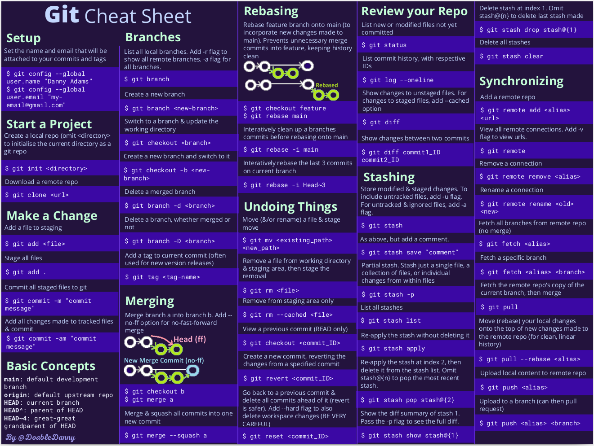

# Guía para un uso básico de Git

## Motivación

Si alguna vez hemos abordado la escritura de un trabajo medianamente extenso al que hemos necesitado ir haciéndole correcciones, probablemente nos haya pasado de terminar teniendo múltiples archivos que refieren a un momento particular de ese proceso de escritura, cada uno con una con alguna modificación o comentario específico.

Esto resulta inconveniente por varios motivos:

- puede que no recordemos cuál es el orden de los archivos (qué versión va primero, cuál después)
- quizá perdamos algún cambio o corrección importante
- tal vez una misma línea fue modificada en más de un archivo
- si solo estamos guardando nuestros cambios en nuestra computadora y algo le sucede, perdemos el trabajo realizado
- si estamos guardando los archivos en alguna nube, puede que no tengamos una forma sencilla de verificar que la versión en la nube está alineada con la que tenemos localmente

Git es un controlador de versiones que nos puede ayudar a resolver todo esto.

    
     
    <em>
        Meme generado con 
        <a href=https://imgflip.com/memegenerator>
        Meme Generator
        </a>
    </em>

## Control de versiones

¿Qué es?
¿Cómo funciona?
¿Qué tipos hay?

## Servidores

Volver a generar meme.

    
     
    <em>
        Meme generado con
        <a href=https://imgflip.com/memegenerator>
        Meme Generator
        </a>
    </em>

Git vs. GitHub

    
     
    <em>
        Imagen tomada de
        <a href=https://blog.devmountain.com/git-vs-github-whats-the-difference>
        Devmountain
        </a>
    </em>

## Primeros pasos

    

### Clonar un repositorio

- clone
### Armar un repositorio

- init
- gitignore
- remote
- config
### Actualizar un repositorio

- add
- commit
- push

    
     
    <em>
        La foto a partir de la cual se generó este
         
        meme fue encontrada en
        <a href=https://www.1news.co.nz/2022/03/28/will-smith-chris-rock-oscars-meme-not-appropriate-luxon>
        1news
        </a>
    </em>

- pull
- diff

    
     
    <em>
        Imagen tomada de
        <a href=https://medium.com/@lulu.ilmaknun.q/kompilasi-meme-git-e2fe49c6e33e>
        Lulu Ilmaknun Qurotaini
        </a>
    </em>

## Deshacer cambios

    
     
    <em>
        Meme generado con
        <a href=https://imgflip.com/memegenerator>
        Meme Generator
        </a>
    </em>

- restore
- reset ~HEAD
- reset
- revert
## Ramas

    

- checkout -b
- branch --list
- branch -D
- push --delete origin

    
     
    <em>
        Meme tomado de
        <a href=https://medium.com/droidsonroids/android-studio-and-git-branches-how-to-simplify-your-work-698aee7c38dc>
        Łukasz Kopociński
        </a>
    </em>

## Merge

    
     
    <em>
        Meme generado con
        <a href=https://imgflip.com/memegenerator>
        Meme Generator
        </a>
    </em>

- merge

### Resolución de conflictos

    
     
    <em>
        Meme generado con 
        <a href=https://imgflip.com/memegenerator>
        Meme Generator
        </a>
    </em>

- cómo resolver conflictos
## Pull Requests

    
     
    <em>
        Meme tomado de
        <a href=https://imgflip.com/memegenerator>
        Meme Generator
        </a>
    </em>

- qué son

    




