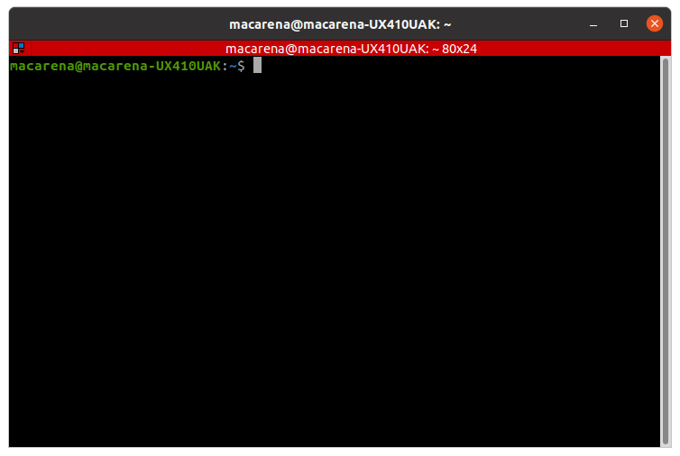

# Nociones básicas de Python

## Ejecución

En este seminario utilizaremos, entre otros recursos, códigos de programación escritos en Python. Existen dos grandes versiones de Python: Python 2 y Python 3. Nosotros usaremos esta última. Más específicamente, usaremos Python 3.8.10.

Existen distintas formas de ejecutar código escrito en Python. Una de ellas es en _notebooks_, como esta que están leyendo. Las notebooks son un entorno computacional interactivo que permiten escribir y ejecutar código de Python, entre otros lenguajes, y combinarlo con fragmentos de texto plano o, incluso, con imágenes.

Otra forma de ejecutar código de Python es mediante la consola o terminal. Para abrir una consola pueden presionar `ctrl+alt` o tocar el botón de inicio y escribir "terminal". Esto les abrirá una ventana como la siguiente:

<div style="text-align:center">
    
</div>

Una vez allí, al escribir "python" y apretar _enter_ se abrirá el intérprete de Python, un programa que lee y ejecuta código escitro en ese lenguaje. Allí podrán leer algo como lo siguiente:

```{python}
Python 3.8.10 (default, Mar 27 2022, 23:42:37) 
[GCC 9.4.0] on linux
Type "help", "copyright", "credits" or "license" for more information.
>>> 
```

Esto les indica que el intérprete se inició con éxito y que están utilizando la versión 3.8.10. Luego del indicador `>>>` pueden escribir sus comandos para ser ejecutados.

En caso de necesitar escribir comentarios al código (muy útiles para poder entenderlo más fácilmente), se puede utilizar el numeral (#). El intérprete (ya sea en consola, ya en un entorno interactivo como una notebook) ignorará las líneas que comiencen con ese símbolo.

## Operaciones aritméticas

En tanto lenguaje, Python tiene elementos que cumplen funciones específicas. Entre ellos, podemos mencionar los números enteros ($\mathbf{Z}$) y racionales ($\mathbf{Q}$) y las operaciones aritméticas como suma, resta y multiplicación entre otras.


```python
1 + 10    # suma
```


    11


```python
3 - 2     # resta
```


    1


```python
2 / 0.5   # división (es lo mismo que escribir 2 / .5)
```


    4.0


```python
3 * 4    # multiplicación
```


    12


```python
100 % 4    # resto de división (0 si la división no tiene resto, 1 si sí lo tiene)
```


    0


```python
100 % 33
```


    1


```python
3 ** 2    # potenciación
```


    9


```python

```


suma, resta, división, resto, multiplicación, elevar al cuadrado, igualdad

import de módulo matemático

## Variables

morfología para denominar variables

mutabilidad

## Tipos de objetos

### Listas

### Conjuntos

### Tuplas

### Diccionarios

### Strings

### Booleanos

## Funciones

## Iteraciones

## Condicionales

**Referencias**

- [Downey, A., Brooks Jr, F. P., Peek, J., Todino, G., Strang, J., Robbins, A., & Rosenblatt, B. (2012). Think python. 2.0. Green Tea Press Supplemental Material:.](https://greenteapress.com/thinkpython2/thinkpython2.pdf)


```python

```
