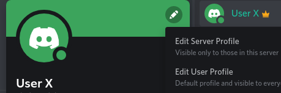

# Configuración del perfil en el servidor de Discord

Con el fin de facilitar la comunicación, pusimos a disposición un servidor de Discord cuyo link pueden encontrar en el [campus del seminario](https://campus.filo.uba.ar/course/view.php?id=2362). Por este canal pueden comunicarse tanto con los docentes como con otros participantes del curso.

Dado que los usuarios de Discord suelen ser _nicknames_ que no siempre se corresponden o permiten identificarnos claramente, les pedimos que tengan a bien configurar su perfil con el nombre y apellido con el que aparecen inscriptios en el seminario. Esto se puede hacer para el servidor específico del seminario y de ningún modo impactaría en el perfil de otro servidor que puedan utilizar.

A continuación les dejamos los pasos para que puedan realizar tal configuración desde la aplicación de escritorio o desde un teléfono celular.

## Configuración en aplicación de escritorio

En primer lugar, deben ubicarse en el servidor, identificado con el siguiente ícono:

En la esquina superior derecha, verán su usuario:

Al hacer click con el botón izquierdo, verán que se les despliega una tarjeta con un lápiz en la esquina superior derecha. Deben cliquear allí y seleccionar la opción _Edit Server Profile_:

Una vez hecho esto, deben colocar su nombre y apellido en el espacio reservado para el nickname:

Recuerden guardar los cambios. El botón para hacerlo se mostrará en la parte inferior de la pantalla:
s

## Configuración en aplicación de celular

De la misma forma que con la aplicación de escritorio, se deben posicionar dentro del servidor. 

Una vez allí, seleccionar la opción para visualizar los participantes del servidor, identificada con el ícono de dos personitas:

Una vez allí, seguir los mismos pasos que con la aplicación de escritorio: cliquear sobre su usuario, elegir la opción para editar el perfil del servirdor y guardar los cambios.

