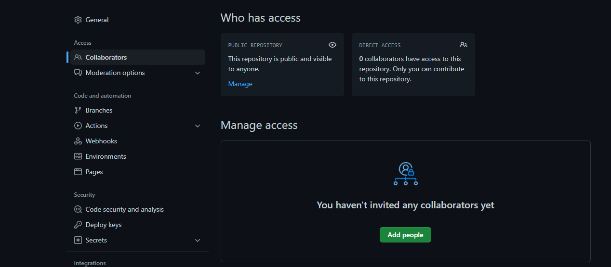

# Flujo de trabajo con git y GitHub

Para completar los trabajos prácticos del seminario, van a tener que hacer cambios en archivos de [este repositorio](https://github.com/fernandocar86/seminario-gramaticas-formales).

Pero para evitar que esos cambios se vean reflejados en el repositorio original que usamos todes, vamos a establecer un flujo de trabajo grupal aprovechando las herramientas que son propias de git y GitHub.

## Formación de grupos

Los trabajos están pensados para ser resueltos en grupo. Cada miembro del grupo resolverá la parte que le corresponda y aportará sus resultados usando git.

### Fork

Una vez definidos los grupos, deberán también definir quién se encargará de hacer un "fork" de este repositorio.

Para ello deberá ir a la página del repositorio:


y seleccionar sobre el lado derecho superior la opción "fork":


Una vez completados los pasos para el "fork", podrá ver este repositorio agregado a su lista personal de repositorios de GitHub.


### Branch Protection

Quien se encargue del fork, también deberá deberá seguir los pasos para proteger la rama "main" de su nuevo repositorio así como seleccionar un número de "approvals" de dos (2) personas que estarán a cargo de aceptar los "pull requests" de cualquier integrante del equipo.

Estos "pull requests" serán la herramienta del equipo docente para revisar y comentar los aportes de cada integrante al trabajo grupal.

Para proteger la rama principal, deberán navegar hasta la solapa "Settings" de su repositorio:


Sobre el lado izquierdo, elegir la solapa "Branches" y cliquear el botón con la leyenda "Add rules".

Una vez desplegadas las opciones, completar del siguiente modo:


Finalizado este paso, está todo listo para seleccionar a l@s demás integrantes del equipo como colaborador@s.

## Colaborador@s

Para agregar colaborador@s, moverse dentro de "Settings" a la primera solapa de la izquierda "Collaborators" y cliquear sobre el botón verde "Add people":



En la ventana emergente, agregar a cada integrante del equipo usando su dirección de mail. Este mail debería remitirlos de manera automática al usuario de GitHub correspondiente, por lo tanto, atención a usar el mismo mail que se usó para crear la cuenta de GitHub.


Cada integrante deberá, a su vez, aceptar la invitación a colaborar que llegará a su dirección de mail. Agregar colaborado@s usando su nombre de GitHub es también posible (pero chequear bien que sea la persona correcta).

Y una vez aceptada la invitación, deberá clonarse el repo de su compañere (no el del seminario) en su ambiente local (su computadora).

Es importante que les integrantes del equipo docente también sean invitades como colaborador@s. Pueden agregarles usando sus nombres en GitHub:

        macfernandez
        fernandocar86
        pablozd
        juliamendoim

## Trabajo en grupo

Los trabajos prácticos van a estar asociados a diferentes temas que veamos en la cursada. Para cada trabajo práctico les vamos a pedir que se creen una rama por integrante del equipo.

### Uso de "branches" (ramas)

Por ejemplo, para el TP número 1, cada integrante del grupo deberá crear una nueva rama de trabajo usando el comando:

```{bash}
git checkout -b tp1/{NOMBRE_INTEGRANTE}
```

Una vez completada su parte del trabajo, deberá seguir los pasos para agregar sus cambios, "commitearlos" y "pushearlos" a GitHub (Cómo hacer todo esto es parte de la clase sobre git y GitHub).

### Pull requests

Una vez que está completa su solución al TP1, deberá hacer, desde GitHub, un "pull request" a la rama "main" (Cómo hacer todo esto es parte de la clase sobre git y GitHub).

Ese "PR" será revisado y comentado por 2 docentes. Los comentarios podrán incluir cambios propuestos que deberán sumarse al PR.

Una vez aprobados los cambios por el equipo docente, se finalizará el "merge" del código a la rama "main" (y se considerará corregido y aprobado el aporte al TP).




