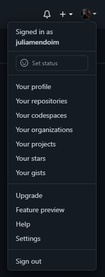
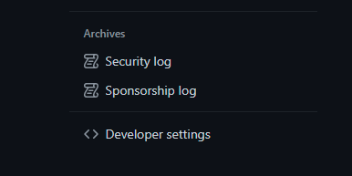
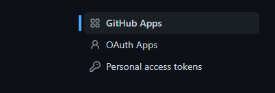
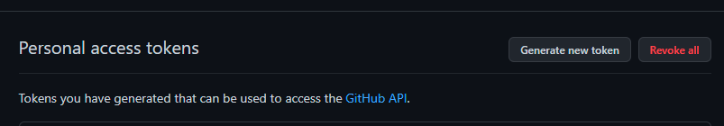
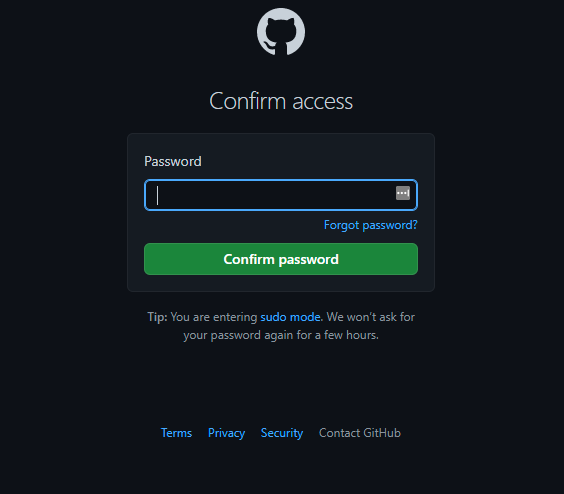
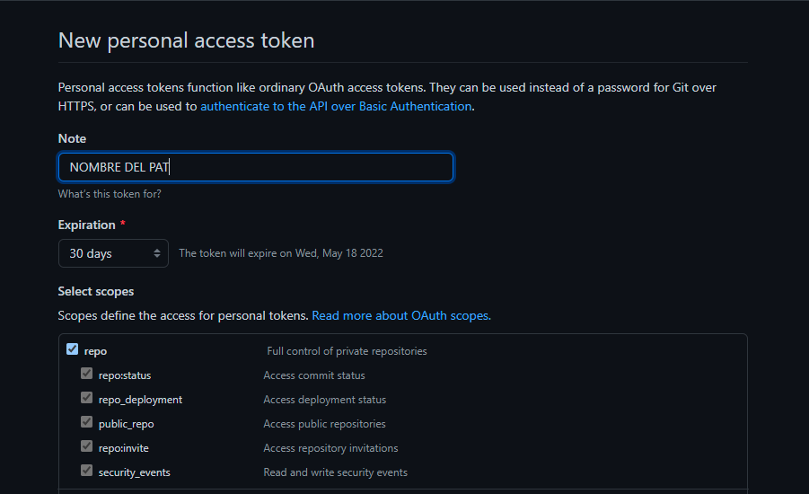
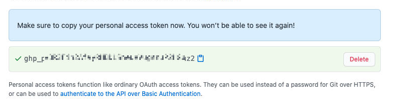

# Cómo generar y usar un token de acceso personal en GitHub

Movete hasta el ícono de tu usuario en GitHub y seleccioná "settings"

  

Si te movés hasta abajo sobre la barra de la derecha, encontrás los "Developer Settings"

  

Si clickeas ahí, vas a encontrarte con el "Personal Access Token"

  

Una vey dentro de la opción "Personal Access Token" debés seleccionar "Generate new token" para generar uno nuevo

  

Te va a pedir que vuelvas a poner tu contraseña para asegurarse de tu identidad:

  

Agregale un nombre, un tipo de permiso ("scopes", preferiblemente "repos") y una cantidad de días en que puede estar habilitado (después de ese tiempo, vas a tener que crear otro si seguís usando el mismo repo en el que pusiste este token)

  

Al final de las opciones de permisos vas a encontrar un botón verde que te permite finalmente crealo:

  

Copiá el token generado. Va a ser la única vez que puedas verlo, pero podés crear tantos como quieras o copiarlo y guardarlo en un lugar seguro:

  

La próxima vez que, al hacer un pull o push, git te pida que coloques tu nombre y tu contraseña de github, usá el token como contraseña. Así quedará fijado hasta que te muevas a otro repo o la contraseña expire:

  

